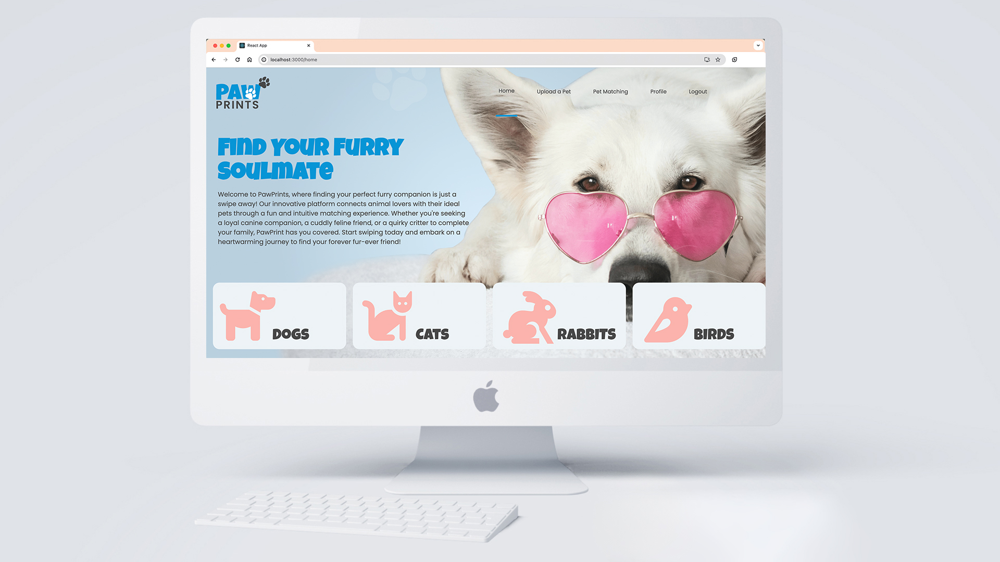
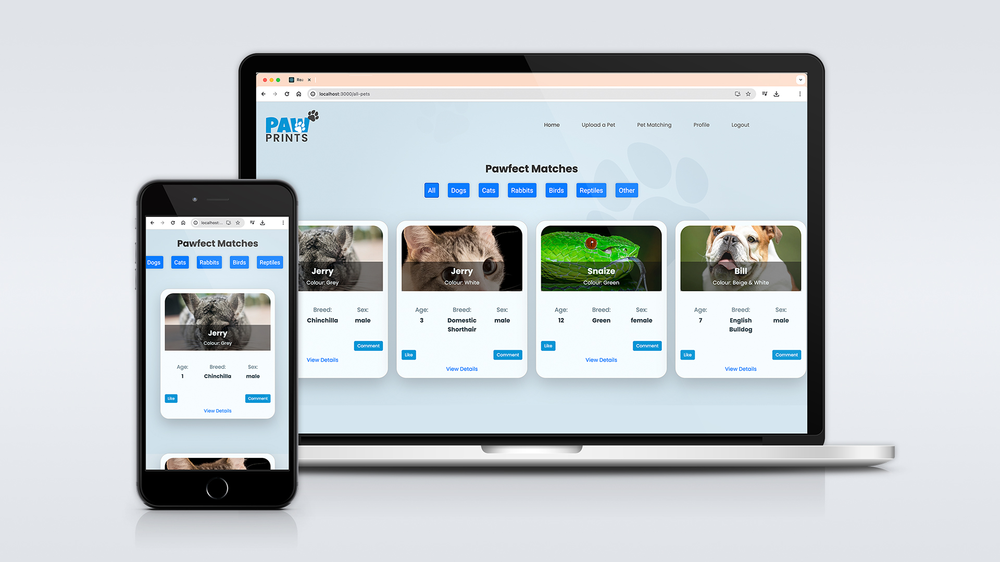
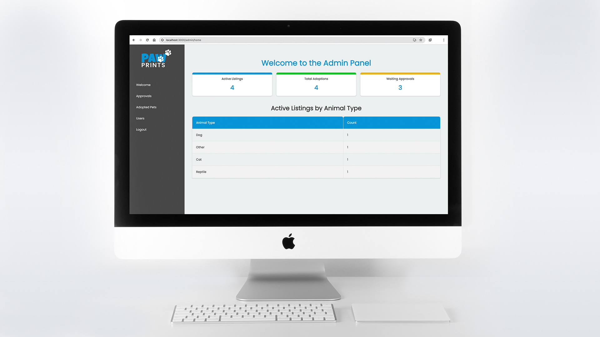

# PawPrints

[→ Watch the demo video here ←](https://drive.google.com/drive/folders/1xGm13AJMhY0ZBnvHRkCNVZ89ZkSkgg_c)

## Overview

PawPrints is a pet adoption application built using the MERN stack (MongoDB, Express.js, React, Node.js). It allows users to register, log in, upload pet listings, like and comment on pets, and adopt pets. Admin users can approve pet listings and manage users.

## Table of Contents
- [Mockups](#mockups)
- [Features](#features)
- [Tech stack](#tech-stack)
- [Installation](#installation)
- [Usage](#usage)
- [API Endpoints](#api-endpoints)
- [Group members](#Group-members)
- [Contributing](#contributing)
- [License](#license)

## Mockups
### User-side Wireframes:







## Features

- User authentication (registration and login)
- Upload pet listings with images
- Like and comment on pet listings
- Adopt pets
- Admin approval for pet listings
- Admin user management
- Responsive design

## Tech stack
- **MongoDB Atlas**: A NoSQL database for storing user and pet data.
- **Express.js**: A web application framework for Node.js, used to build the backend API.
- **React**: A JavaScript library for building user interfaces, used for the frontend of the application.
- **Node.js**: A JavaScript runtime built on Chrome's V8 engine, used to build the backend server.
- **Mongoose**: An ODM (Object Data Modeling) library for MongoDB and Node.js.
- **Axios**: A promise-based HTTP client for the browser and Node.js, used to make API requests from the frontend.
- **Bcrypt**: A library to hash passwords, used to enhance security by storing hashed passwords.
- **Multer**: A middleware for handling multipart/form-data, used for uploading images.

## Installation

1. **Clone the repository**
```
git clone https://github.com/RP231013/PawPrints_DV2_T2_GroupProject
cd pawprints 
```

2. **Set up the backend**
```
cd backend
npm install
```

3. **Set up the frontend**
```
cd ../frontend
npm install
```

4. **Configure environment variables:**
Create a .env file in the backend directory and add the following:
```
PORT=5000
MONGO_URI=your_mongodb_connection_string
JWT_SECRET=your_jwt_secret
```

5. **Start the development servers**
```
cd backend
npm start
```

```
cd ../frontend
npm start
```

6. **Open your browser**
Navigate to `http://localhost:3000` to use the application.

## Usage
#### Registration and Login

Users can register and log in to the application. Admins are identified by their email domain (@ppadmin.com).

#### Uploading Pet Listings

Registered users can upload pet listings with details such as name, type, age, breed, sex, color, and image.

#### Liking and Commenting

Users can like and comment on pet listings. Comments include the user's name and comment text.

#### Adopting Pets

Users can adopt pets, which changes the pet's status to adopted and records the adopting user's details.

#### Admin Functions

Admins can approve pet listings and manage users.

## API Endpoints

### User Routes

- `POST /api/auth/register` - Register a new user
- `POST /api/auth/login` - Log in a user
- `GET /api/users/:id` - Get user details
- `GET /api/users/pets/listed/:id` - Get user's listed pets
- `GET /api/users/pets/liked/:id` - Get user's liked pets
- `GET /api/users/pets/adopted/:id` - Get user's adopted pets

### Pet Listing Routes

- `POST /api/petlisting/upload` - Upload a pet image
- `POST /api/petlisting/add` - Add a new pet listing
- `GET /api/petlisting/unapproved` - Get all unapproved pet listings
- `PUT /api/petlisting/approve/:id` - Approve a pet listing
- `GET /api/petlisting` - Get all pet listings
- `GET /api/petlisting/:id` - Get a pet listing by ID
- `POST /api/petlisting/like/:id` - Like a pet listing
- `POST /api/petlisting/comment/:id` - Add a comment to a pet listing
- `PUT /api/petlisting/adopt/:id` - Adopt a pet
- `DELETE /api/petlisting/:id` - Delete a pet listing


## Group members
- Rouxan Potgieter
- Tebogo Ramobaleng
- Ricard Oosthuizen
- Michaela Kemp

## Contributing

Fork the repository
Create your feature branch (git checkout -b feature/your-feature)
Commit your changes (git commit -m 'Add your feature')
Push to the branch (git push origin feature/your-feature)
Open a pull request

## License

This project is licensed under the MIT License - see the LICENSE file for details.